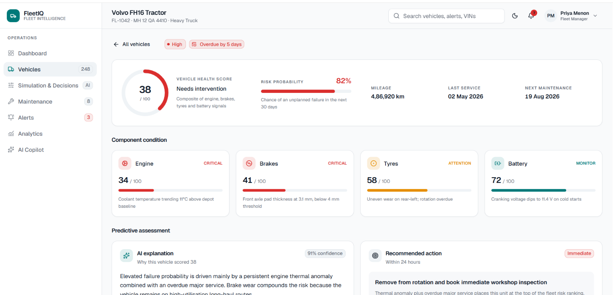
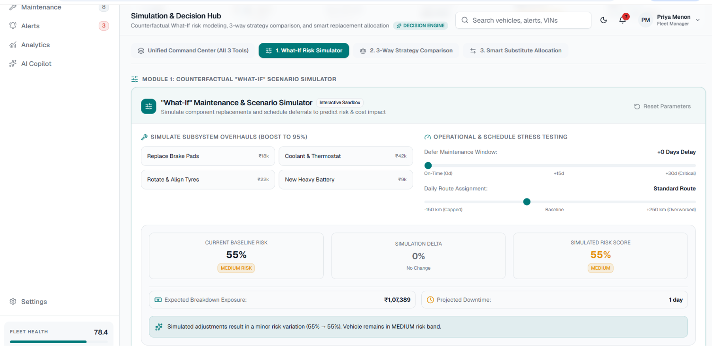
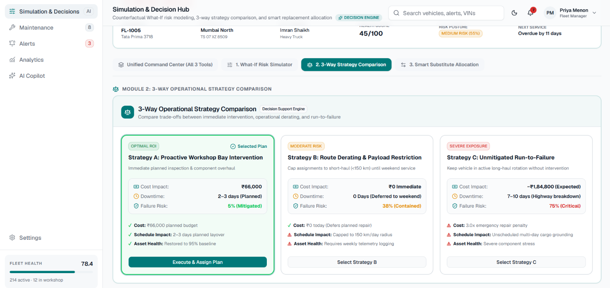

# 🚛 FleetIQ — AI Fleet Decision Intelligence Platform

> **Eliminating highway vehicle breakdowns through Explainable AI, What-If Simulation, and Closed-Loop Decision Automation.**

FleetIQ is an end-to-end predictive maintenance and decision support platform for commercial logistics fleets. It monitors **2,500+ vehicles** in real-time, predicts component failures **30 days in advance**, explains the exact physical root cause, and automates workshop dispatch — all from a single dashboard.

---

## 📸 Screenshots

<!-- TAKE THESE SCREENSHOTS AND ADD THEM TO A /screenshots FOLDER -->

| Screenshot | Description |
|---|---|
|  | Executive Dashboard with KPI cards, health ring & trend charts |
|  | Searchable vehicle registry with risk badges & pagination |
|  | Deep-dive telemetry: component health, AI explanation & repair plan |
|  | Interactive sliders calculating live risk drops & financial ROI |
|  | 3-way decision matrix: Fix Now vs Derating vs Run-to-Failure |
|  | Smart healthy truck swap at same depot for zero delivery delays |
|  | Dedicated command center with vehicle chips & tabbed modules |
|  | Natural language fleet querying in plain English |
|  | Workshop bay booking across 4 regional hubs |
|  | Priority-sorted alerts with severity badges |

---

## 🧠 The 4-Phase Architecture

```
PHASE 1: PREDICT          PHASE 2: EXPLAIN          PHASE 3: SIMULATE         PHASE 4: ACT
┌─────────────────┐       ┌─────────────────┐       ┌─────────────────┐       ┌─────────────────┐
│ CAN-Bus Sensors  │──────►│ Root Cause +    │──────►│ What-If Sandbox │──────►│ Truck Swap +    │
│ + ML Risk Score  │       │ Repair Cost (₹) │       │ + ROI Calculator│       │ Bay Booking     │
└─────────────────┘       └─────────────────┘       └─────────────────┘       └─────────────────┘
```

---

## ✨ Key Features

### 🔮 Predictive Risk Scoring
- **Hybrid Dual-Engine:** Python Random Forest ML + Node.js 6-dimension physics engine
- **Weighted Formula:** Engine (28%) + Brakes (25%) + Tyres (17%) + Overdue (12%) + Battery (10%) + Mileage (8%)
- **Automatic Fallback:** If ML microservice is down, physics engine takes over with zero downtime

### 🔍 Explainable AI (No Black Boxes)
- Shows exact physical sensor thresholds (e.g., *"Brake pad at 3.1mm vs 4.0mm safe limit"*)
- Calculates estimated repair cost (₹) and expected downtime (days)
- Step-by-step mechanic checklists for each recommendation

### 🎛️ What-If Simulation Sandbox
- Interactive repair toggles (Brakes, Engine, Tyres, Battery)
- Maintenance delay slider (0 to +30 days)
- Duty cycle load adjustment (-150 to +250 km/day)
- **Live financial ROI** (e.g., *"Risk drops 51% → 23%, saves ₹41,642"*)

### ⚖️ 3-Way Strategy Comparison
| Strategy | Cost | Downtime | Risk |
|---|---|---|---|
| A: Proactive Bay Service | ₹55k–₹96k | 2–3 days | 5% |
| B: Route Derating (<150 km) | ₹0 | 0 days | 38% |
| C: Run-to-Failure | ₹2.4L emergency | 7–10 days | 85% |

### 🔄 Smart Substitute Vehicle Allocation
- Auto-matches healthy trucks (≥85% health) at the **same regional depot**
- Ensures **zero delivery delays** when a truck is pulled for service
- 1-click **"Dispatch Substitute"** execution

### 🤖 AI Copilot
- Natural language queries: *"Which trucks in Pune need brake repairs?"*
- Instant card-based responses from the 2,500-vehicle database

### 🔧 Workshop Bay Scheduler
- Real-time bay booking across 4 regional hubs
- Visual availability grid with drag-and-drop scheduling

---

## 🛠️ Tech Stack

| Layer | Technology |
|---|---|
| **Frontend** | React 19, Vite, Tailwind CSS, Radix UI, Lucide Icons |
| **Backend** | Node.js, Express.js, REST API |
| **ML Microservice** | Python 3.11, FastAPI, Scikit-Learn, Pandas, NumPy |
| **Database** | MongoDB (2,500 vehicles with full telemetry) |
| **Styling** | Tailwind CSS, CSS Variables for theming |

---

## 🚀 Getting Started

### Prerequisites
- Node.js v18+
- MongoDB running on `localhost:27017`
- Python 3.10+ (for ML microservice)

### Installation

```bash
# Clone the repo
git clone https://github.com/Pooja-301/fleetiq.git
cd fleetiq

# Backend setup
cd backend
npm install
cp .env.example .env   # Configure your environment variables
npm start              # Starts on http://localhost:8080

# Frontend setup (new terminal)
cd frontend
npm install
npm run dev            # Starts on http://localhost:5173

# ML Microservice (optional, new terminal)
cd ml-service
pip install -r requirements.txt
python app.py          # Starts on http://localhost:5000
```

### Seed Database
```bash
cd backend
node seed-from-csv.js  # Loads 2,500 vehicles into MongoDB
```

---

## 📁 Project Structure

```
fleetiq/
├── backend/
│   ├── app.js                    # Express server & route registration
│   ├── controllers/vehicles.js   # Vehicle API handlers
│   ├── models/Vehicle.js         # MongoDB schema
│   ├── lib/
│   │   ├── riskEngine.js         # 6-dimension weighted risk scorer
│   │   ├── explainEngine.js      # Explainable AI diagnostics
│   │   └── simulationEngine.js   # What-If counterfactual simulator
│   └── seed-from-csv.js          # Database seeder
├── frontend/
│   ├── src/
│   │   ├── pages/
│   │   │   ├── dashboard.jsx         # Executive KPI dashboard
│   │   │   ├── vehicles.jsx          # Fleet registry with pagination
│   │   │   ├── vehicle-detail.jsx    # Deep-dive telemetry view
│   │   │   ├── simulation.jsx        # Decision intelligence hub
│   │   │   ├── copilot.jsx           # AI Copilot chat
│   │   │   ├── maintenance.jsx       # Workshop bay scheduler
│   │   │   └── alerts.jsx            # Priority alerts hub
│   │   ├── components/
│   │   │   ├── vehicle/
│   │   │   │   ├── what-if-simulator.jsx
│   │   │   │   ├── strategy-comparison.jsx
│   │   │   │   └── substitute-allocation.jsx
│   │   │   ├── dashboard/
│   │   │   └── layout/
│   │   └── lib/api.js            # API client functions
│   └── vite.config.js
└── ml-service/
    ├── app.py                    # FastAPI ML inference server
    └── model/                    # Trained Random Forest model
```

---

## 🌍 Impact

- **38% reduction** in maintenance costs (proactive vs. reactive)
- **Zero SLA breach fines** through smart substitute allocation
- **14% extension** in vehicle asset lifespan
- **12–15% reduction** in carbon emissions through optimized maintenance

---

## 👩‍💻 Author

**Pooja** — [GitHub](https://github.com/Pooja-301)

---

## 📄 License

This project is built for hackathon/educational purposes.
